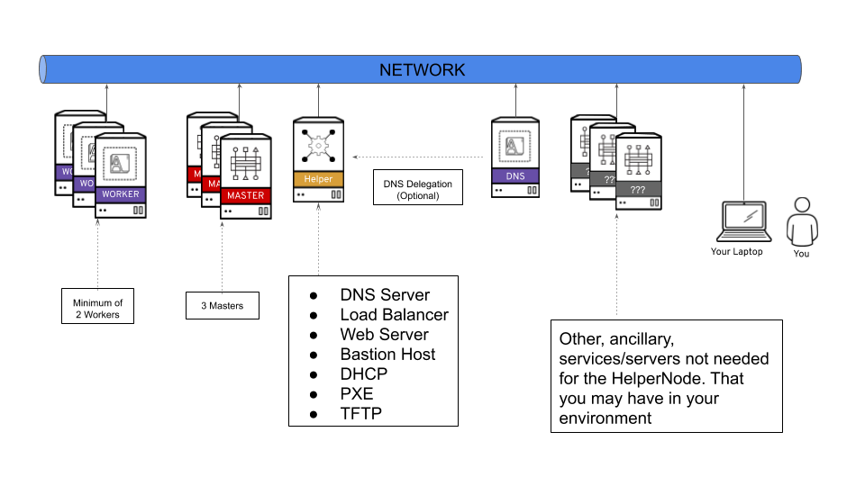

# HelperNode v2

The HelperNode is a way to satisfy all the prerequisites needed in order to install OpenShift 4. In version 2 of the HelperNode, all prerequisites/services need are run in containers and Ansible is no longer used.

For more information about the prerequisites. Please see the [official OpenShift documentation site](https://docs.openshift.com/container-platform/latest)

The HelperNode is a node/vm/server that sits on your network running all the services needed in an "all-in-one" way. The following diagram shows a highlevel view of where the HelperNode sits on your network.

> NOTE: You can, and is recommended, delegate a subdomain to the HelperNode if you have a working DNS server in your environment. For example; if you want a `$CLUSTERID` of *ocp4*, and you have a `$DOMAIN` of *example.com*. Then you will delegate `ocp4.example.com` to the HelperNode.

The HelperNode is meant to help you install an OpenShift 4 cluster using the Platform Agnostic UPI install method (formerly known as the "BareMetal UPI" method). It's not meant to do the install for you. This isn't an automation tool, but rather a tool that should be used with your current automation.

# HelperNode Prerequisites

The `helpernodectl` utility is only supported/tested with the following:

* RHEL/CentOS 8
* Podman 1.6.4
* Firewalld 0.8.0

The version of OpenShift is "tied" to the binary. For the current version, we are using OpenShift 4.6.4
